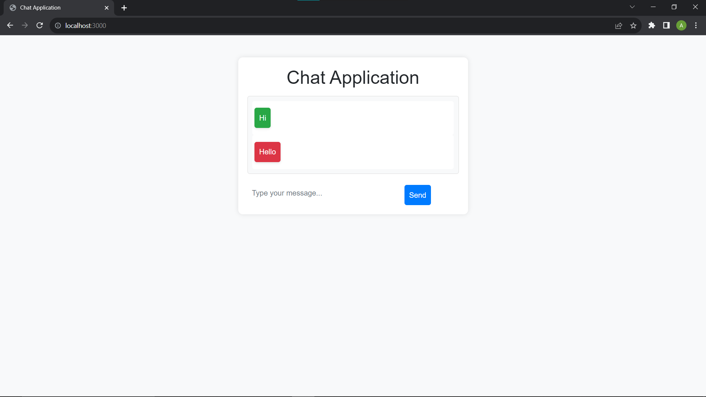

# Chat Application



This basic chat application was developed using WebSockets, Node.js, and Bootstrap CSS. It allows users to enter a chat room, and send and view other participants' messages in real-time.

## Table of Contents

- [Getting Started](#getting-started)
  - [Prerequisites](#prerequisites)
  - [Installation](#installation)
- [Usage](#usage)
- [Features](#features)

## Getting Started

These instructions will help you set up and run the chat application on your local machine.

### Prerequisites

- Node.js: Make sure you have Node.js installed. You can download it from the official website: [https://nodejs.org/](https://nodejs.org/)

### Installation

1. Clone the repository:

   ```bash
   git clone https://github.com/YourUsername/CodeClauseInternship_ChatApplication.git
   cd CodeClauseInternship_ChatApplication
   ```

2. Install the required dependencies:

   ```bash
   npm install
   ```

## Usage

1. Start the server:

   ```bash
   node index.js
   ```

2. Open a web browser and navigate to: [http://localhost:3000](http://localhost:3000)

3. Start sending and receiving messages in the chat room.

## Features

- Real-time messaging using WebSockets
- User-friendly interface with Bootstrap CSS

---

This chat application was developed as part of the CodeClause Internship Program.
